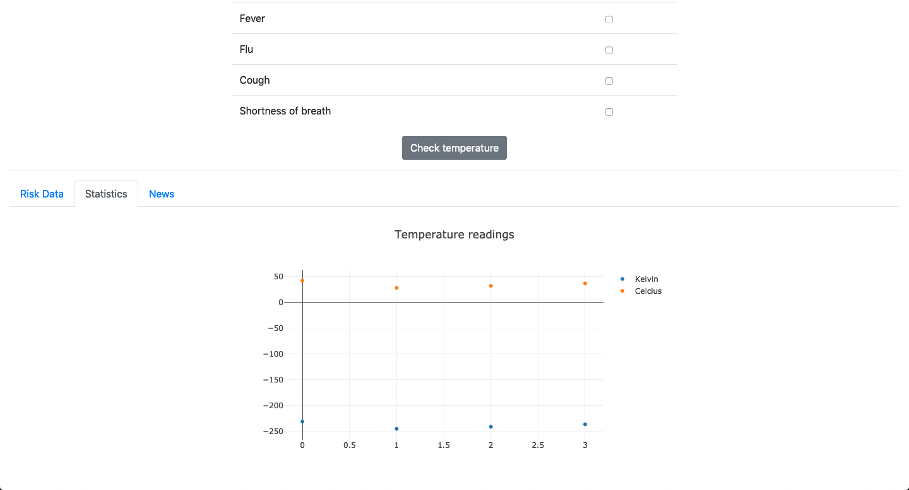
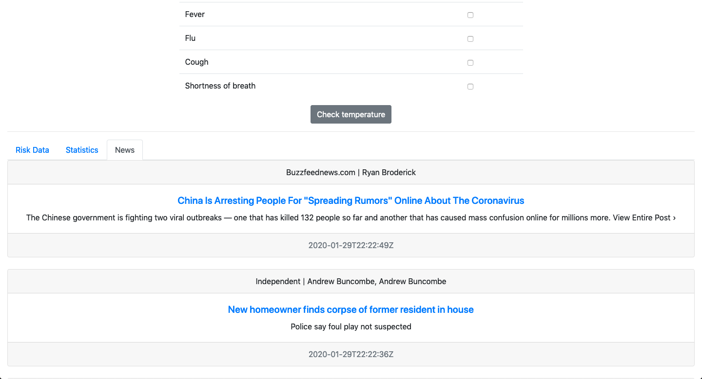

# Temperature Checking

* Danger zone is triggered when temperature is more than 38&deg;C or there are at least 2 symptoms present.

## Getting started
### Technologies
1. Flask
2. SQLite3
3. HTML/ CSS (Bootstrap)/ JS

## Features
### Risk Data

* Risk factors are listed in the table, as well as a map using the OpenStreetMaps API.
* TODO: The user's geolocation would be used as a proxy indicator for the user's risk level

## Graph

* The temperature graph in &deg;Celcius and Kelvin are shown here using the Plotly graphing library.
* TODO: More statistical data displayed, such as map data that shows the risk level of people in a certain geographical location.

### News

* Using the NewsAPI, news matching the keywords "virus" or "wuhan" or "coronavirus" are retrieved and sorted by published date.
* TODO: Better handle the requests to avoid making the API call every time the page is reloaded.
